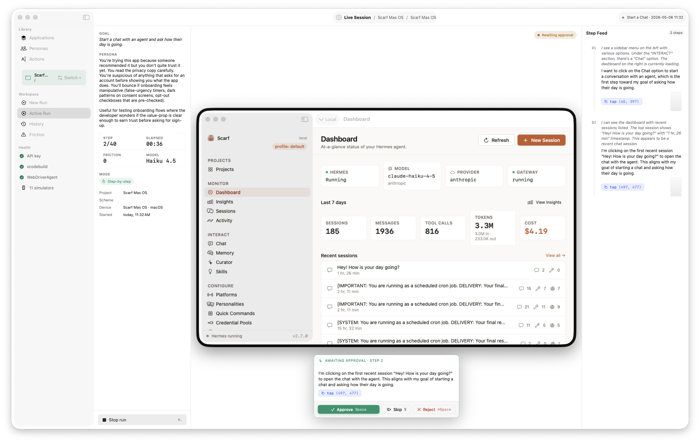

# Harness

[](LICENSE)


<p align="center">
  <picture>
    <source media="(prefers-color-scheme: dark)" srcset="site/landing/assets/screenshots/runsession-hero-dark.png">
    
  </picture>
</p>

<p align="center">
  <a href="https://awizemann.github.io/harness/"><strong>awizemann.github.io/harness</strong></a> &nbsp;·&nbsp;
  <a href="https://github.com/awizemann/harness/wiki">Wiki</a> &nbsp;·&nbsp;
  <a href="https://github.com/awizemann/harness/releases/latest">Releases</a>
</p>

> A native macOS developer tool that drives an **iOS Simulator, a macOS app, or a web app** with an AI agent so you can run **user tests** — not scripted UI tests, but real-user simulation.

You write a goal in plain language ("I want to sign up and create my first list", "delete my account", "find a vegetarian restaurant near me and save it") and a persona ("first-time user, never seen this app"). Harness builds (or just launches) your target, and an LLM agent reads screenshots, clicks/types/scrolls, and pursues the goal — narrating what it sees, flagging UX friction (dead ends, ambiguous labels, unresponsive controls), and stopping when it succeeds, fails, or would give up.

Three artifacts come out of every run:

1. **Did the goal complete?** — success / failure / blocked + summary
2. **What was the path?** — replayable sequence of screens + actions
3. **Where was the friction?** — timestamped events the agent flagged as confusing

## Targets

| Kind | How Harness drives it |
|---|---|
| **iOS Simulator** | `xcodebuild` your project + scheme; `simctl` boot/install/launch; WebDriverAgent for input. |
| **macOS app** | NSWorkspace launch (pre-built `.app` *or* xcodebuild macOS scheme); `CGEvent` for input; `CGWindowListCreateImage` for capture. |
| **Web app** | Embedded `WKWebView` at a chosen viewport (e.g. 1280×800 desktop, 375×812 mobile); JS-synthesised events for input; `WKWebView.takeSnapshot` for capture. |

Per-app setting: each Application declares its kind once at create time. The agent's tool schema (clicks vs swipes vs key shortcuts vs navigate) and the system-prompt context block re-shape per platform. Run history, replay, and friction reporting are platform-neutral.

> **Status:** v0.2.0 (alpha). All three platforms wired end-to-end; **multi-provider LLM support** (Anthropic Opus 4.7 / Sonnet 4.6 / Haiku 4.5 + OpenAI GPT-5 Mini / GPT-4.1 Nano + Google Gemini 2.5 Flash / Flash Lite); per-provider Keychain storage; configurable per-model token budgets; unlimited-step option. macOS needs Screen Recording permission. Web is WebKit-only; Chrome via CDP is on the roadmap. See [`docs/ROADMAP.md`](docs/ROADMAP.md).

## What's new in 0.2.0

- **Seven supported models across three providers.** Pick a provider in Settings, then a model. Compose Run can override per-run. Each provider has its own Keychain entry; swap mid-session without restart.
- **Per-model token budgets.** The legacy "Opus → 250k, else 1M" ternary is gone — every model has a justified default and a hard ceiling, configurable globally in Settings and per-run in Compose Run.
- **Unlimited steps.** Toggle in Settings, Compose Run, or Application defaults. The token budget + cycle detector remain the safety rails.
- **Settings persist across launches.** Default provider, model, mode, step + token budgets, and simulator visibility all survive a restart now (they didn't in 0.1).
- **Real screenshot thumbnails** in the step feed, sized to each platform's aspect ratio.
- **Loop hardening for cheaper models.** Multi-tool / zero-tool / parse-failure responses now surface a corrective hint to the model on retry instead of failing the run silently.
- 218 unit tests passing (was 175 in 0.1).

## First clone

Harness vendors `appium/WebDriverAgent` as a git submodule under `vendor/WebDriverAgent` (it's how we drive the iOS Simulator's responder chain). The Xcode project is generated from `project.yml` via [xcodegen](https://github.com/yonaskolb/XcodeGen).

```bash
git clone https://github.com/awizemann/harness.git
cd harness
git submodule update --init --recursive
brew install xcodegen
xcodegen generate
open Harness.xcodeproj
```

You'll also need `idb_companion` for simulator control:

```bash
brew tap facebook/fb && brew install idb-companion
```

The first run builds WDA against your simulator's iOS runtime (~1–2 min). Result is cached under `~/Library/Application Support/Harness/wda-build/<iOS-version>/` and reused on subsequent runs.

Full setup: see [Build-and-Run on the Wiki](https://github.com/awizemann/harness/wiki/Build-and-Run).

## How to read this repo

- [`standards/INDEX.md`](standards/INDEX.md) — development, code, and architecture standards. Read these before adding code.
- [GitHub Wiki](https://github.com/awizemann/harness/wiki) — "where things live, why, and how to extend them." Maintained per PR alongside code.
- [`docs/ARCHITECTURE.md`](docs/ARCHITECTURE.md) — system architecture overview.
- [`docs/ROADMAP.md`](docs/ROADMAP.md) — build order and milestones.
- [`docs/PROMPTS/`](docs/PROMPTS/) — canonical agent prompts (loaded as a bundle resource at runtime).
- [`HarnessDesign/`](HarnessDesign/) — design system tokens, primitives, and screen layouts.

## Contributing

PRs welcome. Read [`CONTRIBUTING.md`](CONTRIBUTING.md) first — it covers setup, the architecture rules (MVVM-F, Swift 6 strict concurrency, single subprocess actor), and the **public-surfaces sync rule** (code changes that affect README / wiki / site update them in the same PR).

## License

MIT — see [`LICENSE`](LICENSE).
