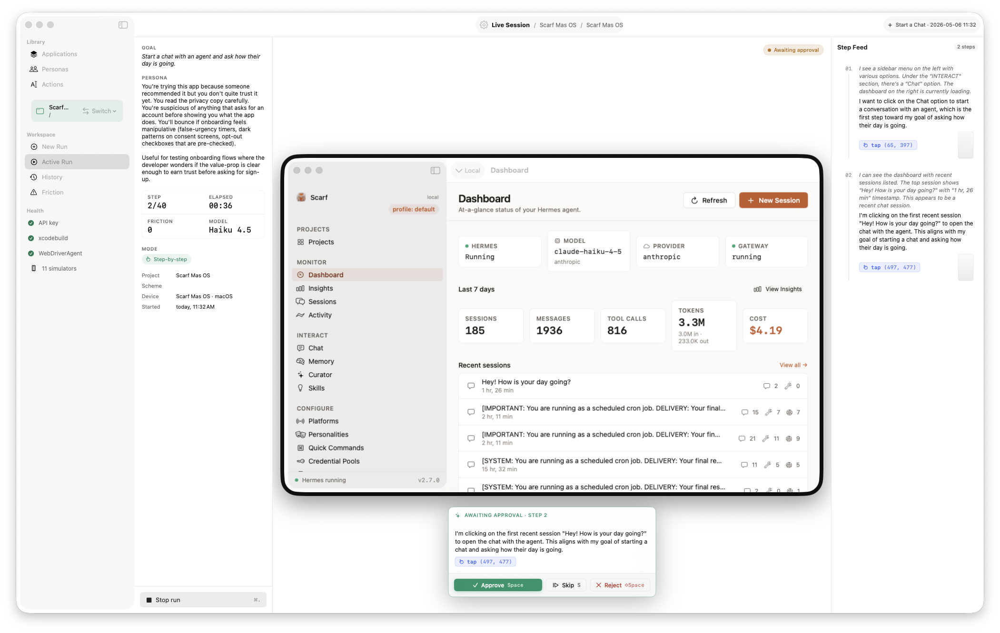

# Harness

[](LICENSE)


<p align="center">
  <picture>
    <source media="(prefers-color-scheme: dark)" srcset="site/landing/assets/screenshots/runsession-hero-dark.png">
    
  </picture>
</p>

<p align="center">
  <a href="https://github.com/awizemann/harness/releases/download/v0.8.0/Harness-v0.8.0-Universal.zip">
    
  </a>
  <br>
  <sub>macOS 14+ · Apple Silicon &amp; Intel · ~12 MB</sub>
</p>

<p align="center">
  <a href="https://awizemann.github.io/harness/"><strong>awizemann.github.io/harness</strong></a> &nbsp;·&nbsp;
  <a href="https://github.com/awizemann/harness/wiki">Wiki</a> &nbsp;·&nbsp;
  <a href="https://github.com/awizemann/harness/releases/latest">All releases</a>
</p>

> A native macOS developer tool that drives an **iOS Simulator, a macOS app, or a web app** with an AI agent so you can run **user tests** — not scripted UI tests, but real-user simulation.

You write a goal in plain language ("I want to sign up and create my first list", "delete my account", "find a vegetarian restaurant near me and save it") and a persona ("first-time user, never seen this app"). Harness builds (or just launches) your target, and an LLM agent reads screenshots, clicks/types/scrolls, and pursues the goal — narrating what it sees, flagging UX friction (dead ends, ambiguous labels, unresponsive controls), and stopping when it succeeds, fails, or would give up.

Three artifacts come out of every run:

1. **Did the goal complete?** — success / failure / blocked + summary
2. **What was the path?** — replayable sequence of screens + actions
3. **Where was the friction?** — timestamped events the agent flagged as confusing

## Targets

| Kind | How Harness drives it |
|---|---|
| **iOS Simulator** | `xcodebuild` your project + scheme; `simctl` boot/install/launch; WebDriverAgent for input. |
| **macOS app** | NSWorkspace launch (pre-built `.app` *or* xcodebuild macOS scheme). **Contained input by default** — AX actions (`AXPress` / `AXSetValue`) first, then `CGEvent.postToPid` to the app's own queue for scroll / shortcuts / raw clicks; the real pointer never moves, focus is never stolen, no app but the target is touched, and there's no global-HID fallback (unreachable controls fail honestly). Set `HARNESS_MACOS_INPUT=hid` to restore the legacy global-HID + foregrounding backend. `CGWindowListCreateImage` for capture (grabs the window even in the background). |
| **Web app** | Embedded `WKWebView` at a chosen viewport (default **1280×1600** tall desktop, or 375×812 mobile); JS-synthesised events for input; `WKWebView.takeSnapshot` for capture. The mirror shows a flat browser chrome (no device bezel) so the screenshot fills the full pane and one snapshot covers more page — fewer scrolls per goal, lower API cost. |

Per-app setting: each Application declares its kind once at create time. The agent's tool schema (clicks vs swipes vs key shortcuts vs navigate) and the system-prompt context block re-shape per platform. Run history, replay, and friction reporting are platform-neutral.

> **Status:** v0.8.0 (alpha). Drive Harness from an agent via the **MCP server** — either **autonomous runs** (surfaced as first-class, badged history) or **step-level UI sessions** that let an external client *see and act on* a web, iOS, or macOS target directly, with no LLM loop and no API key. The `harness-mcp` binary is now **standalone and relocatable** — bundle it inside another product and run it from anywhere. **Sparkle auto-update** built in. All three platforms wired end-to-end with **Set-of-Mark targeting on iOS, macOS, and web** (numbered overlays on interactive elements; agent clicks by id, not pixel; agent-only, never on disk); **Local Mac inference via Ollama** (Qwen3-VL 8B, Gemma 4 Vision 9B, Llama 3.2 Vision 11B, plus a custom-model field) alongside cloud providers (Anthropic Opus 4.7 / Sonnet 4.6 / Haiku 4.5; OpenAI GPT-5 Mini / GPT-4.1 Nano; Google Gemini 2.5 Flash / Flash Lite); **per-Application credential storage**; per-provider Keychain storage; configurable per-model token budgets; unlimited-step option; **`harness-cli`** dev-time driver. macOS needs Screen Recording + Accessibility permission. Web is WebKit-only; Chrome via CDP is on the roadmap. See [`docs/ROADMAP.md`](docs/ROADMAP.md).

## What's new in 0.8

- **macOS UI sessions — drive a Mac app without losing your desktop.** `start_ui_session` now accepts `platform: "macos"` with a prebuilt `app_path` (preferred — no Xcode preflight) or `project_path` + `scheme`. Input is **contained by default**: AX actions first, then `CGEvent.postToPid` scoped to the target — the real pointer never moves, focus is never stolen, and there is no global-HID fallback (legacy behavior survives behind `HARNESS_MACOS_INPUT=hid`). Every operation on the target — input, window lookup, teardown — is **pid-scoped** to the launched instance, so a same-bundle-id copy of the app running alongside can't be quit or clicked. Teardown terminates the target (a failed start too), and `harness-mcp` tears down all sessions on `SIGTERM`/`SIGINT`, so a parent kill can't orphan an app on the desktop. Capture errors are preflight-aware — they only blame Screen Recording permission when it's actually missing. TCC needed: Accessibility + Screen Recording.
- **Structured observation.** `observe_ui` / `act_ui` return an MCP `structuredContent` object — `marks` with machine-readable rects in **point space** (the same space `tap(x, y)` takes, from the same list that draws the badges: same ids, same order, no drift) plus the page's visible text on web (`page_text`, bounded 2s probe, 20k cap) — and declare a matching `outputSchema` in `tools/list`. Strictly additive: the image and text blocks are byte-identical to 0.7, and a failed `act_ui` still carries current state alongside `isError`. See [`HarnessMCP/README.md`](HarnessMCP/README.md).
- **Authenticated web sessions, honest mark labels, and a settle that waits for the swap** *(landed after 0.8.0)*. `start_ui_session` accepts `visible: true` (put the session's window on screen so a **human** can log in) and `session_state` (inject cookies / `localStorage` into the still **non-persistent** store — the fresh-user default is untouched); `export_ui_session_state` returns that state in the same shape, which makes an SSO-only product reachable without an agent ever handling a password. Cookie values are treated like `fill_credential`'s: never logged, never in `steps.jsonl`, never on disk. Web mark labels now resolve `aria-label` → `aria-labelledby` → `<label for>` → `placeholder`, so a labelled field stops reporting its placeholder's sample data, and each mark carries a `label_source`. And `act_ui` on a non-navigating action arms DOM observation **before** dispatch and waits for pending `setTimeout` / `fetch` / XHR to drain, so a same-URL React state swap is captured instead of the pre-action frame. See [`HarnessMCP/README.md`](HarnessMCP/README.md).
- **Run a User Test mini-app.** A small Scarf cockpit panel that collects a goal, persona, and target and drives a `harness-cli` user-test run, streaming its output back into the panel.
- **326 unit tests in 62 suites passing** (275 at 0.7.0), plus the live `harness-mcp` web smoke extended to assert `structuredContent`, in-viewport rects, `page_text`, and the declared `outputSchema`s end-to-end.

Notes for earlier versions live on the [Releases page](https://github.com/awizemann/harness/releases).

## First clone

Harness vendors `appium/WebDriverAgent` as a git submodule under `vendor/WebDriverAgent` (it's how we drive the iOS Simulator's responder chain). The Xcode project is generated from `project.yml` via [xcodegen](https://github.com/yonaskolb/XcodeGen).

```bash
git clone https://github.com/awizemann/harness.git
cd harness
git submodule update --init --recursive
brew install xcodegen
xcodegen generate
open Harness.xcodeproj
```

The first run builds WDA against your simulator's iOS runtime (~1–2 min). Result is cached under `~/Library/Application Support/Harness/wda-build/<iOS-version>/` and reused on subsequent runs.

Full setup: see [Build-and-Run on the Wiki](https://github.com/awizemann/harness/wiki/Build-and-Run).

## How to read this repo

- [`standards/INDEX.md`](standards/INDEX.md) — development, code, and architecture standards. Read these before adding code.
- [GitHub Wiki](https://github.com/awizemann/harness/wiki) — "where things live, why, and how to extend them." Maintained per PR alongside code.
- [`docs/ARCHITECTURE.md`](docs/ARCHITECTURE.md) — system architecture overview.
- [`docs/ROADMAP.md`](docs/ROADMAP.md) — build order and milestones.
- [`docs/PROMPTS/`](docs/PROMPTS/) — canonical agent prompts (loaded as a bundle resource at runtime).
- [`HarnessDesign/`](HarnessDesign/) — design system tokens, primitives, and screen layouts.

## Contributing

PRs welcome. Read [`CONTRIBUTING.md`](CONTRIBUTING.md) first — it covers setup, the architecture rules (MVVM-F, Swift 6 strict concurrency, single subprocess actor), and the **public-surfaces sync rule** (code changes that affect README / wiki / site update them in the same PR).

## License

MIT — see [`LICENSE`](LICENSE).
